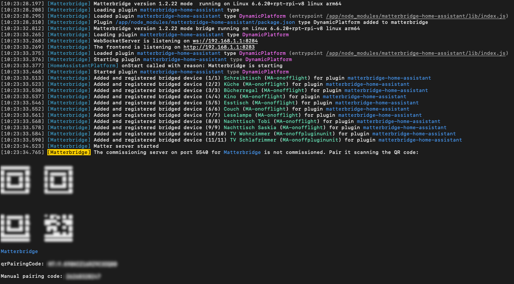

# Matterbridge Home Assistant

---

This **Matterbridge Home Assistant** package provides bindings to
connect [HomeAssistant](https://www.npmjs.com/package/home-assistant-js-websocket)
to [Matterbridge](https://github.com/Luligu/matterbridge/).

## Installation

### Manual Setup

- Follow [those instructions](https://github.com/Luligu/matterbridge/?tab=readme-ov-file#installation) to
  setup `matterbridge`.
- Install the plugin `npm install -g matterbridge-home-assistant`
- Make sure the plugin is configured properly using environment variables (see [Configuration](#configuration)).
- Activate the plugin `matterbridge -add matterbridge-home-assistant`
- Start matterbridge using `matterbridge -bridge`

### Home Assistant Add-On

Follow the [Home Assistant Add-On Repository](https://github.com/t0bst4r/matterbridge-home-assistant-addon) to install
Matterbridge with Home Assistant.

### Custom Docker Deployment

There is a [ready-to-use docker image](https://github.com/t0bst4r?tab=packages&repo_name=matterbridge-home-assistant)
built with this project.

Running it is as easy as starting any other Docker container. Just make sure to run the container with the host network,
since that is required for matter clients to connect.

The docker image is configured using environment variables (see [Configuration](#configuration)).

```bash
# Create a volume to persist the data written by matterbridge (optional)
docker volume create matterbridge-data

# Start the container
docker run -d \
  --network host \
  --volume matterbridge-data:/root/.matterbridge \
  --env HOME_ASSISTANT_URL="http://192.168.178.23:8123" \
  --env HOME_ASSISTANT_ACCESS_TOKEN="ey....yQ" \
  --env HOME_ASSISTANT_CLIENT_CONFIG='{ "includeDomains": ["light", "media_player"], "excludePatterns": ["media_player.*echo*"] }' \
  --name matterbridge
  ghcr.io/t0bst4r/matterbridge-home-assistant:latest
```

Or using docker-compose.yaml

```yaml
services:
  matterbridge:
    image: ghcr.io/t0bst4r/matterbridge-home-assistant:latest
    restart: unless-stopped
    network_mode: host
    environment:
      HOME_ASSISTANT_URL: 'http://192.168.178.23:8123'
      HOME_ASSISTANT_ACCESS_TOKEN: 'ey....yQ'
      HOME_ASSISTANT_CLIENT_CONFIG: |
        {
          "includeDomains": ["light", "media_player"],
          "excludePatterns": ["media_player.*echo*"]
        }
    volumes:
      - data:/root/.matterbridge
volumes:
  data:
```

## Configuration

This package can be configured using environment variables.

### Using Environment Variables

- `HOME_ASSISTANT_URL` - the home assistant url (e.g. `http://192.168.178.23:8123`)
- `HOME_ASSISTANT_ACCESS_TOKEN` - a long living access token created in Home Assistant
- `HOME_ASSISTANT_CLIENT_CONFIG` - a json string containing the client config (see below)

### Using a config file

_This works for the Custom Docker Deployment only!_

You can mount the following JSON file to your Docker container (wherever you like).

```json
{
  "homeAssistantUrl": "http://192.168.178.23:8123",
  "homeAssistantAccessToken": "ey....yQ",
  "homeAssistantClientConfig": {
    "includeDomains": ["light", "media_player"],
    "excludePatterns": ["media_player.*echo*"]
  }
}
```

To tell the application to load your JSON file, just point the `CONFIG_FILE` environment variable to the path of this file:

```bash
docker run -d \
  --network host \
  --volume matterbridge-data:/root/.matterbridge \
  --volume $PWD/matterbridge-config:/config:ro \
  --env CONFIG_FILE="/config/matterbridge-config.json" \
  --name matterbridge
  ghcr.io/t0bst4r/matterbridge-home-assistant:latest
```

Whenever a property is missing in the provided JSON config, it will use the environment variables as fallback.
So your config could look like this:

```json
{
  "homeAssistantUrl": "http://192.168.178.23:8123",
  "homeAssistantClientConfig": {
    "includeDomains": ["light", "media_player"],
    "excludePatterns": ["media_player.*echo*"]
  }
}
```

```bash
docker run -d \
  --network host \
  --volume matterbridge-data:/root/.matterbridge \
  --volume $PWD/matterbridge-config:/config:ro \
  --env CONFIG_FILE="/config/matterbridge-config.json" \
  --env HOME_ASSISTANT_ACCESS_TOKEN="ey....yQ" \
  --name matterbridge
  ghcr.io/t0bst4r/matterbridge-home-assistant:latest
```

### Client Config

The client config has to be a json string and can have the following properties:

```typescript
interface HomeAssistantClientConfig {
  /**
   * The domains to include.
   * @example [ "light", "media_player" ]
   */
  includeDomains?: Array<string>;
  /**
   * Glob-Patterns to include entities.
   * @example [ "light.*", "media_player.*_tv_*" ]
   */
  includePatterns?: Array<string>;
  /**
   * The domains to exclude.
   * Exclusions are always winning against inclusions.
   * @example [ "media_player" ]
   */
  excludeDomains?: Array<string>;
  /**
   * Glob-Patterns to exclude entities.
   * Exclusions are always winning against inclusions.
   * @example [ "media_player.*echo*" ]
   */
  excludePatterns?: Array<string>;
}
```

**Entities must match any of `includePatterns` or `includeDomains` and most not match any of `excludeDomains` and `excludePatterns`.**

### Example Configuration

```
HOME_ASSISTANT_URL=http://192.168.178.23:8123
HOME_ASSISTANT_ACCESS_TOKEN=ey....yQ
HOME_ASSISTANT_CLIENT_CONFIG={ "includeDomains": ["light", "media_player"], "excludePatterns": ["media_player.*echo*"] }
```

## Commissioning / Pairing the device with your Matter controller

Start matterbridge and find the commissioning QR code in the logs.
This code can be used to connect your Matter controller (like Alexa, Apple Home or Google Home) to the bridge.



## Supported Entities

- Light entities (`light.`) including on-off, brightness and hue & saturation control
- Switch entities (`switch.`) including on-off control
- Input-Boolean entities (`input_boolean.`) including on-off control
- Media Players (`media_player.`) are mapped to Switches and currently only support on-off control
- Climate Devices (`climate.`) only support temperature, yet. **Not tested. Please provide feedback!**
- Scenes (`scene.`) are mapped to Switches and currently only support on-off control
- Scripts (`script.`) are mapped to Switches and currently only support on-off control
- Automations (`automation.`) are mapped to Switches and currently only support on-off control

# Contributors

[](https://github.com/t0bst4r/matterbridge-home-assistant/graphs/contributors)

---

[](https://www.buymeacoffee.com/t0bst4r)
