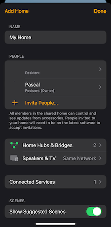
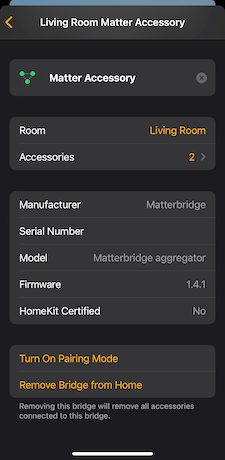
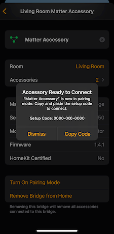
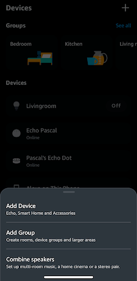
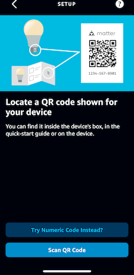
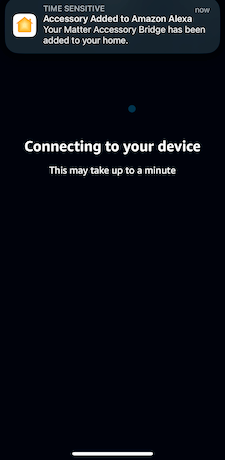

# How can I connect to multiple controllers at once?

You can connect the Matter device to multipl controllers like Alexa, Apple Home or Google Home by putting it into
pairing mode again. As of now you need to do that in another already connected controller.

1. In your already connected controller (e.g. Apple Home) go to your Home settings. Go to "Home Hubs & Bridges" and
   select the Bridge. There you'll find a button "Turn on Pairing mode". You will get a pairing code which we will need
   to connect it using the new controller. 
   
   
   
   

2. Next in your new controller (e.g. Alexa) add a new device and select "Matter" as its type. You'll be asked if you
   want to use a paring QR code or if you want to enter a numeric code. Select "Try Numeric Code" and enter the code you
   got from your first controller in the first step. Alexa will now connect to your Bridge. 
   
   
   
