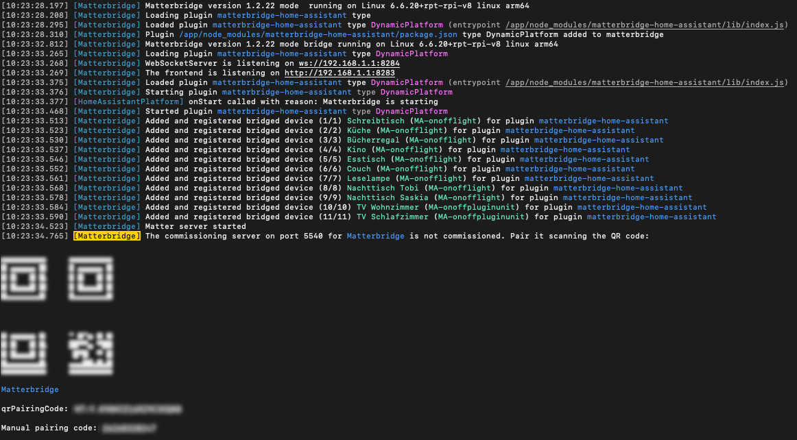

# Matterbridge Home Assistant

---

This **Matterbridge Home Assistant** package provides bindings to
connect [HomeAssistant](https://www.home-assistant.io/) with [Matterbridge](https://github.com/Luligu/matterbridge/).

---

[](https://www.buymeacoffee.com/t0bst4r)

---

## Breaking Changes: Migrating from 1.x to 2.x

- In version 1.x this plugin was meant to be configured using multiple environment variables. Due to the growing number
  of configuration options, this has been changed. This plugin requires to be configured using a configuration JSON file
  or one single environment variable containing the whole JSON configuration.
  **Please see the [configuration section](#configuration) below.**

## Installation

### Manual Setup / Global installation

- Install matterbridge and the plugin `npm install -g matterbridge matterbridge-home-assistant`
- Make sure the plugin is configured properly (see [Configuration](#configuration)).
- Activate the plugin `matterbridge -add matterbridge-home-assistant`
- Start matterbridge using `matterbridge -bridge`

If you are getting the error message `Only supported EndpointInterface implementation is Endpoint`:

- This is caused by npm's module resolution of globally installed modules and project-chip's way of doing
  an `instanceOf` check.
- It happens when matterbridge and matterbridge-home-assistant are not installed in **one** install command as above.

### Manual installation / using a package.json

- create a new working directory
- create a `package.json` with the following content

```json
{
  "dependencies": {
    "matterbridge": "^1.4.0",
    "matterbridge-home-assistant": "^2.0.3"
  },
  "scripts": {
    "register": "matterbridge -add ./node_modules/matterbridge-home-assistant",
    "start": "matterbridge -bridge"
  }
}
```

- run `npm run register` and `npm run start`

**Important: ** this method does not allow installing or updating matterbridge plugins using the UI!

### Home Assistant Add-On

Follow the [Home Assistant Add-On Repository](https://github.com/t0bst4r/matterbridge-home-assistant-addon) to install
Matterbridge with Home Assistant.

### Custom Docker Deployment

There is a [ready-to-use docker image](https://github.com/t0bst4r?tab=packages&repo_name=matterbridge-home-assistant)
built with this project.

Running it is as easy as starting any other Docker container. Just make sure to run the container with the host network,
since that is required for matter clients to connect.

The docker image is configured using environment variables (see [Configuration](#configuration)).

```bash
# Create a volume to persist the data written by matterbridge (optional)
docker volume create matterbridge-data

# Start the container
docker run -d \
  --network host \
  --volume matterbridge-data:/root/.matterbridge \
  --volume $PWD/config.json:/app/config.json \
  --env MHA_CONFIG_FILE="/app/config.json" \
  --name matterbridge \
  ghcr.io/t0bst4r/matterbridge-home-assistant:latest
```

Or using docker-compose.yaml

```yaml
services:
  matterbridge:
    image: ghcr.io/t0bst4r/matterbridge-home-assistant:latest
    restart: unless-stopped
    network_mode: host
    environment:
      MHA_CONFIG: |
        {
          "homeAssistant": {
            "url": "http://192.168.178.23:8123/",
            "accessToken": "ey....yQ",
            "matcher": {
              "includeDomains": ["light"]
            }
          }
        }
    volumes:
      - data:/root/.matterbridge
volumes:
  data:
```

## Configuration

This package can be configured using a config file or an environment variable. If both are present, the environment
variable will be used.

### Using a file

This package can be configured using a JSON config file. Use the environment variable `MHA_CONFIG_FILE` to point it
to the config file. See [config structure](#config-structure).

### Using an environment variable

This package can be configured using an environment variable. Use the environment variable `MHA_CONFIG` and put the JSON
configuration in it. See [config structure](#config-structure).

### Config structure

```json5
{
  // optional:
  devices: {
    // optional: override the vendorId for all devices
    vendorId: 0,
    // optional: override the vendorName for all devices
    vendorName: 't0bst4r',
  },
  // required:
  homeAssistant: {
    // required:
    // when home assistant and matterbridge both run in docker on the same host,
    // using localhost or 127.0.0.1 will not work!
    // use the external ip address or hostname instead
    // e.g. 192.168.178.23 or my-raspi.lan
    url: 'http://192.168.178.23:8123',
    // required:
    accessToken: 'ey....yQ',
    // optional:
    matcher: {
      // optional: include all entities of these domains:
      includeDomains: ['light'],
      // optional: include all entities matching these entity_id patterns:
      includePatterns: ['media_player.samsung_tv_*'],
      // optional: include all entities having one of these labels.
      // IMPORTANT: you need to label the ENTITY, not the device.
      // It is important to use the slug of the label. When your label is "My Devices", the slug is most probably "my_devices".
      includeLabels: ['My Devices'],
      // optional: include all entities having one of the following platforms (= integration)
      // It is important to use the slug of the platform / integration.
      includePlatforms: ['hue'],
      // optional: exclude all entities of these domains:
      excludeDomains: ['lock'],
      // optional: exclude all entities matching these entity_id patterns:
      excludePatterns: ['media_player.*echo*'],
      // optional: exclude all entities having one of these labels.
      // IMPORTANT: you need to label the ENTITY, not the device.
      // It is important to use the slug of the label. When your label is "My Devices", the slug is most probably "my_devices".
      excludeLabels: ['My Devices'],
      // optional: exclude all entities having one of the following platforms (= integration)
      // It is important to use the slug of the platform / integration.
      excludePlatforms: ['hue'],
    },
  },
  // optional: override settings per domain or per entity
  overrides: {
    // optional: override settings per domain
    domains: {
      // optional: currently only covers support overrides.
      // See "Override settings for Domains or Entities" section
      cover: {},
    },
    // optional: override settings per entity
    entities: {
      // optional: currently only covers support overrides.
      // see "Override settings for Domains or Entities" section
      'cover.my_cover': {},
    },
  },
}
```

**Entities must match any of the `include` matchers and must not match any of `exclude` matchers.**

### Override settings for Domains or Entities

Some domains can have optional special configurations which apply to either the whole domain, or to single entities.
The settings for `overrides.domains` and `overrides.entities` share the same structure.

<details>
  <summary>Cover</summary>

```json5
{
  // optional: override settings for the "Lift" feature of a cover
  lift: {
    // optional:
    // Home Assistant uses 0% as "Closed" and 100% as "Opened"
    // Matter uses 100% as "Closed" and 0% as "Opened"
    // Therefore we need to invert the percentages to properly match both specifications.
    // Saying "set the cover to 10%" to Alexa means it is 10% closed, or 90% open.
    // This is enabled by default. If your Cover should NOT behave inverted, set this setting to `false`.
    // Setting it to `false` will probably lead to strange behaviour when using the "Close/open the cover" sentence.
    // To prevent this, use the next attribute (swapOpenAndClosePercentage).
    // Both attributes (invertPercentage and swapOpenAndClosePercentage) could be combined to invert the WHOLE behaviour.
    invertPercentage: true,

    // optional:
    // Some users don't want to invert the percentages, because they want it to behave "wrong" but more naturally:
    // Saying "set the cover to 10%" should lead to 10% open, or 90% closed.
    // Therefore the previous setting (invertPercentage) should be set to "false".
    // On the other hand this leads Alexa to actually open the covers when just saying "Open the cover",
    // because it sets the percentage to 100% to close it, but 100% means "open" in HA.
    // For this case, I have added this attribute. It will just swap 0% and 100% (only those - all other values in between will not be inverted).
    // Both attributes (invertPercentage and swapOpenAndClosePercentage) could be combined to invert the WHOLE behaviour.
    swapOpenAndClosePercentage: true,
  },
}
```

</details>

## Commissioning / Pairing the device with your Matter controller

Start matterbridge and find the commissioning QR code in the logs.
This code can be used to connect your Matter controller (like Alexa, Apple Home or Google Home) to the bridge.



## Supported Entities

- Automations (`automation.`) are mapped to Switches and currently only support on-off control
- Binary Sensor entities (`binary_sensor.`) provide their state (e.g. on / off)
- Cover Devices (`cover.`) are currently all mapped to "Window Covering"
- Fan Devices (`fan.`) are currently mapped to Dimmable Plugin Units, because most of the Matter controllers do not support fans.
- Input-Boolean entities (`input_boolean.`) including on-off control
- Light entities (`light.`) including on-off, brightness and hue & saturation control
- Lock Devices (`lock.`) including Locking and Unlocking. Some Matter controllers (like Alexa) do not allow unlocking locks by default. It needs to be enabled in the Alexa App for each Lock.
- Media Players (`media_player.`) are mapped to Switches and currently only support on-off control
- Scenes (`scene.`) are mapped to Switches and currently only support on-off control
- Scripts (`script.`) are mapped to Switches and currently only support on-off control
- Switch entities (`switch.`) including on-off control

## Frequently Asked Questions

### Why doesn't Matterbridge find new entities which were just added to home assistant?

`matterbridge-home-assistant` scans all entities once during startup and checks their visibility state.
After that it only subscribes to state changes (on-off, color, etc.). Restart Matterbridge to find the new entities
to be added.

### How can I hide entities beside the include/exclude patterns?

`matterbridge-home-assistant` compares entity_ids to the include/exclude patterns and domains, but also considers the
hidden state of an entity (can be found in the entity details in Home Assistant).
Both are only checked once during startup, so changes will apply after restarting Matterbridge.

### Why doesn't Matterbridge remove entities, which I just marked as hidden?

`matterbridge-home-assistant` compares entity_ids to the include/exclude patterns and domains, but also considers the
hidden state of an entity (can be found in the entity details in Home Assistant).
Both are only checked once during startup, so changes will apply after restarting Matterbridge.

### I am getting this error message `Only supported EndpointInterface implementation is Endpoint`:

- This is caused by npm's module resolution of globally installed modules and project-chip's way of doing an `instanceOf` check.
- It happens when matterbridge and matterbridge-home-assistant are not installed in **one** install command as above. See the [installation section](#installation) above.

## Contribution, Bug Reports and Enhancements

Please head over to the [GitHub Repository](https://github.com/t0bst4r/matterbridge-home-assistant) and review the
README, and its contribution section.
